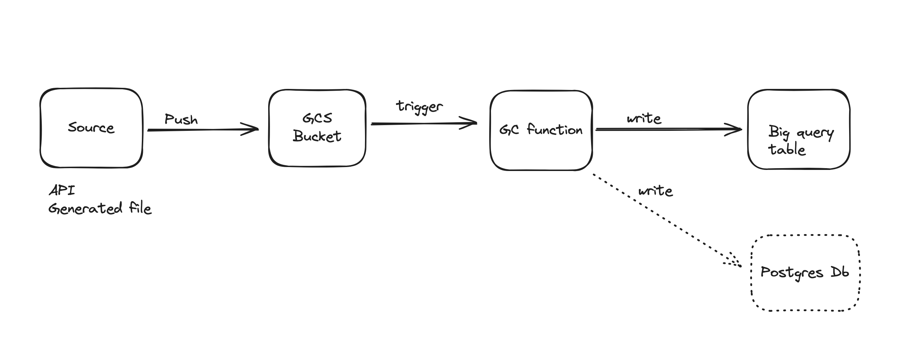

# Manage Google cloud function : (GCS) to Bigquery table


## Description
I designed a simple process that simulates , a source system generating data > writing it to a GCS bucket >> the bucket then triggers a cloud function >> that writes the data to a bigquery table

## Table of Contents
- [Features](#features)
- [Installation](#installation)
- [Usage](#usage)


## Features
* requirements.txt
#### data_generator folder: contains script that generates data and writes to a gcs bucket
* gcs_manager.py : Google Cloud storage manager python class
* config.py : contains constants used in main.py 
#### gcp_function folder: contains script used by the gcp function
* bq_manager.py: bigquery resource manager python class
* main.py : Simple data pipeline
* .env.example file

## Installation
1. **Clone the repository:**
    

2. **Navigate to the project directory:**
   

3. **Install the dependencies:**
    ```bash
    pip install -r requirements.txt
    ```

4. **Set up environment variables:**
    Create a `.env` file in the root directory and add the necessary environment variables. follow the .env.example file as a guide

5. **Set up config variables:**
    Update the config.py file with your own variables.

6. **Set up your GCS function:**
    Create a gcs functions with the scripts found in the folder gcp_function

7.  **Create a Dataset in biquery:**
    replace the table name in gcs functions main.py with your desired dataset and table name

## Usage

1. **Run the Query:**
    ```
    python main.py
    ```
2. **Check the Bigquery table:**
 ```
    check the biquery table to see the data written to it.
    ```


